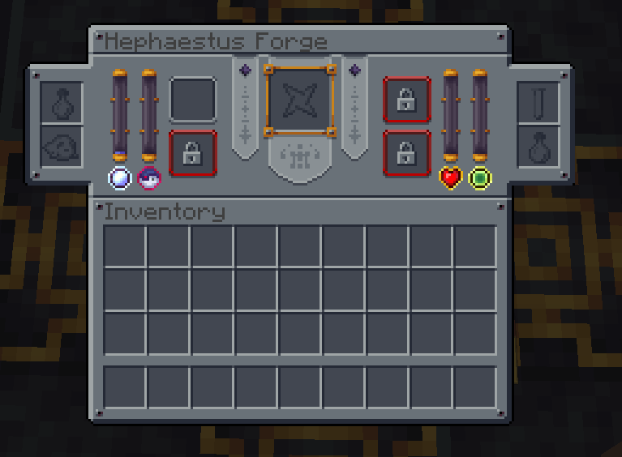

---
navigation:
  title: Hephaestus Forge
  icon: forbidden_arcanus:hephaestus_forge
item_ids:
  - forbidden_arcanus:hephaestus_forge
---

# Hephaestus Forge

<GameScene zoom="2">
  <ImportStructure src="../game_scenes/hephaestus_forge_structure.nbt" />
</GameScene>

# What is Hephaestus Forge?
The <ItemLink id="forbidden_arcanus:hephaestus_forge" /> is a type of ritual that can make some interesting items, that includes armors, weapons and rare items.

This is a UI of the Hephaestus Forge, you can see that middle slot, in it put the center of recipe. The slots that have special texture are the essences input slots 

To complete the recipe, a special symbol must appear on the floor of the structure. If it appears, right-click with a hammer from the Forbidden Arcanus.

Each essence has a counter that shows how many essence are in the storage.

# Essences
Hephaestus forge consumes some resources to create items, they are

* Aureal
  
Can be extracted by <ItemLink id="forbidden_arcanus:aureal_bottle" /> ( or <ItemLink id="forbidden_arcanus:splash_aureal_bottle" />) and by placing <ItemLink id="forbidden_arcanus:arcane_crystal_obelisk" /> above <ItemLink id="forbidden_arcanus:arcane_chiseled_polished_darkstone" /> in the structure

<GameScene zoom="2">
  <ImportStructure src="../game_scenes/hephaestus_forge_w_1_arcane_obelisk.nbt" />
</GameScene>

---

* Souls 
Can be extracted using soul items

| Item                                     |   Amount |
| ---------------------------------------- | ------: |
| <ItemLink id="forbidden_arcanus:soul" />   |  1  |
| <ItemLink id="forbidden_arcanus:corrupt_soul" />   |  1  |
| <ItemLink id="forbidden_arcanus:enchanted_soul" />  |  10 |

--- 

Blood

Blood can be obtained killing entities and using <ItemLink id="forbidden_arcanus:mystical_dagger" /> and you need to has your inventory contains <ItemLink id="forbidden_arcanus:test_tube" /> or killing mobs near Hephaestus Forge Altar

---

Experience

Experience easily can be obtained placing <ItemLink id="minecraft:experience_bottle" /> or <ItemLink id="forbidden_arcanus:xpetrified_orb" /> in the input slot

---

# Building Structure

To build hephaestus forge in your world, you need:

* 48 Polished Darkstone
* 9 Arcane Chiseled Polished Darkstone
* 4 Chiseled Arcane Polished Darkstone
* 1 Mundabitur Dust
* 1 Smithing Table

## First;
Place <ItemLink id="forbidden_arcanus:polished_darkstone" />, <ItemLink id="forbidden_arcanus:arcane_chiseled_polished_darkstone" /> and <ItemLink id="forbidden_arcanus:chiseled_arcane_polished_darkstone" /> that way

<GameScene zoom="2">
  <ImportStructure src="../game_scenes/hephaestus_forge_step_1.nbt" />
</GameScene>

## Second;
Place <ItemLink id="minecraft:smithing_table" /> in the center of structure

<GameScene zoom="2">
  <ImportStructure src="../game_scenes/hephaestus_forge_step_2.nbt" />
</GameScene>

## Third;
Shift-right-click with <ItemLink id="forbidden_arcanus:mundabitur_dust" /> in <ItemLink id="minecraft:smithing_table" />

<GameScene zoom="2">
  <ImportStructure src="../game_scenes/hephaestus_forge_step_3.nbt" />
</GameScene>

## Finally;
Place the <ItemLink id="forbidden_arcanus:darkstone_pedestal" /> above <ItemLink id="forbidden_arcanus:arcane_chiseled_polished_darkstone" />

<GameScene zoom="2">
  <ImportStructure src="../game_scenes/hephaestus_forge_step_4.nbt" />
</GameScene>

* You can replace <ItemLink id="forbidden_arcanus:darkstone_pedestal" /> into <ItemLink id="forbidden_arcanus:magnetized_darkstone_pedestal" />

# Upgrading Forge

Hephaestus forge has 5 tiers, these tiers changes the amount of storage altar has and unlock new recipes.

So many recipes need 2+ altar tier, then if you want to progress in the pack, you need a high tier altar.

