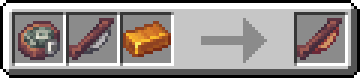
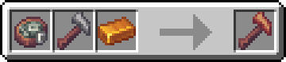
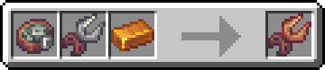
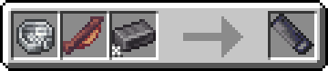
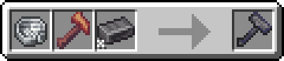
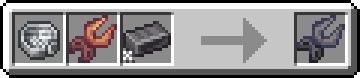

---
navigation:
  title: Crafting Tools
  icon: kubejs:basic_hammer
  parent: techlab.md
  item_ids:
    - kubejs:basic_hammer
---

# Crafting Tools

The crafting are used to craft contraptions in early stage of the pack. They has a durability that is spent on crafts (The cost is variable) and upgrading tool-tier they incrase their durability.

- Even low-level tools can be used in all crafts.

- Later you change this tools by other machines

# Tools Tiers

- ## Primitive Tools

<Row>
  <ItemImage id="kubejs:primitive_saw" scale="2" />
  <ItemImage id="kubejs:primitive_hammer" scale="2" />
  <ItemImage id="kubejs:primitive_wirecutter" scale="2" />
</Row>

Primitive Tools are the most basic tools in TechPack, they are used to craft some contraptions and itens.

You can craft them as follows
<Row>
<Recipe id="minecraft:shaped/primitive_saw" />
<Recipe id="minecraft:shaped/primitive_hammer" />
<Recipe id="minecraft:shaped/primitive_wirecutter" />
</Row>

- ## Rustic Tools

<Row>
    <ItemImage id="kubejs:rustic_saw" scale="2" />
    <ItemImage id="kubejs:rustic_hammer" scale="2" />
    <ItemImage id="kubejs:rustic_wirecutter" scale="2" />
</Row>

Rustic Tools are the medium tier tools in TechPack. They are obtained at begginig of [Chapter II] when you can make your fists bronze ingots.

* They incrase the durability in ***184*** points compared with all primitive tools

- ## Basic Tools

<Row>
    <ItemImage id="kubejs:basic_saw" scale="2" />
    <ItemImage id="kubejs:basic_hammer" scale="2" />
    <ItemImage id="kubejs:basic_wirecutter" scale="2" />
</Row>

Basic Tools are the most advanced tools in TechPack (at the moment). They are obtained at endinig of [Chapter II] when you can make your fists steel ingots.

* They incrase the durability in ***388*** points compared with all rustic tools and ***572*** points compared with all basic tools

